<!--
  Profile README for darpanzope.
  Source-of-truth in darpanzope/portfolio: github-profile.md
  Theme: cyan #22d3ee · violet #a78bfa · emerald #34d399
         amber #fbbf24 · pink #f472b6
-->

<a href="https://darpan.cloud">
  
</a>

<h1 align="center"><code>~/darpan</code></h1>

<p align="center">
  <em>I run platforms the way I'd run a customer's.</em>
</p>

<p align="center">
  <a href="https://readme-typing-svg.demolab.com">
    
  </a>
</p>

<p align="center">
  <a href="https://darpan.cloud"></a>
  <a href="https://darpan.cloud/status/"></a>
  
  
</p>

<p align="center">
  Nine years across DevOps, SRE, cloud, blockchain infra, and security &amp; compliance — most recently leading platform teams shipping infra that serves millions of users with SOC&nbsp;2&nbsp;/&nbsp;ISO&nbsp;27001&nbsp;/&nbsp;HIPAA guardrails baked in.
</p>

<p align="center">
  <strong>Full portfolio + interactive sandboxes + case studies →</strong> <a href="https://darpan.cloud"><strong>darpan.cloud</strong></a>
</p>

---

<p align="center">
  
</p>

---

## What I build

> Four disciplines, one platform mindset. Click a pillar for the deep-dive.

<table>
  <tr>
    <td width="50%" valign="top">
      <a href="https://darpan.cloud/pillars/devops/"></a>
      <br><sub>CI/CD · GitOps · observability · on-call discipline · paved roads. Reduced one client's deploy time from <strong>1h → 5min</strong> on Jenkins.</sub>
    </td>
    <td width="50%" valign="top">
      <a href="https://darpan.cloud/pillars/cloud/"></a>
      <br><sub>Six cloud platforms · multi-region DR · on-prem → cloud migrations with sub-5-min cutover · FinOps at scale.</sub>
    </td>
  </tr>
  <tr>
    <td width="50%" valign="top">
      <a href="https://darpan.cloud/pillars/blockchain/"></a>
      <br><sub>EVM + non-EVM full / archive / trader nodes · VRF &amp; Oracle services from scratch · validator operations · chain-upgrade orchestration.</sub>
    </td>
    <td width="50%" valign="top">
      <a href="https://darpan.cloud/pillars/security/"></a>
      <br><sub>Three frameworks shipped · 100% first-try audit pass · zero standing VPNs · Vault-driven dynamic credentials in minutes not days.</sub>
    </td>
  </tr>
</table>

---

## Currently · on the bench

```diff
+ shipping ........ darpan.cloud — interactive portfolio with live REPL,
                    drag-drop platform sandbox, and AWS cost calculator
~ operating ....... 25+ chain RPC fleet across 5 ecosystems
~ leading ......... SOC 2 Type II surveillance audit prep
> exploring ....... eBPF-powered observability for k8s data plane
> reading ......... "Database Internals" (Petrov), "Site Reliability Workbook"
```

---

## The stack I reach for

<details open>
<summary><strong>CI / CD</strong></summary>
<p>
  
  
  
  
  
</p>
</details>

<details open>
<summary><strong>Infrastructure as Code</strong></summary>
<p>
  
  
  
  
  
</p>
</details>

<details open>
<summary><strong>Runtime &amp; Orchestration</strong></summary>
<p>
  
  
  
  
  
  
</p>
</details>

<details open>
<summary><strong>Observability</strong></summary>
<p>
  
  
  
  
  
  
  
</p>
</details>

<details open>
<summary><strong>Secrets &amp; Zero-Trust</strong></summary>
<p>
  
  
  
  
</p>
</details>

<details open>
<summary><strong>Blockchain</strong></summary>
<p>
  
  
  
  
  
  
  
  
</p>
</details>

<details open>
<summary><strong>Languages</strong></summary>
<p>
  
  
  
  
</p>
</details>

---

## Try it without leaving GitHub

Two interactive surfaces on the portfolio that genuinely earn the click:

<table>
  <tr>
    <td width="50%" valign="top">
      <h3><a href="https://darpan.cloud/sandbox/platform/">/sandbox/platform</a></h3>
      Drag tools onto a canvas, click an output port then an input port to wire them, and a live narration panel calls out what's healthy and what would page someone at 2am. Powered by an opinionated 11-rule validation engine.
    </td>
    <td width="50%" valign="top">
      <h3><a href="https://darpan.cloud/sandbox/cost/">/sandbox/cost</a></h3>
      Four sliders → live monthly AWS bill estimate + a real Terraform skeleton you can copy or download. Inputs serialise to URL query so a configuration is shareable. Honest comparison strip vs. a naive single-region setup.
    </td>
  </tr>
</table>

Or open the hero terminal on darpan.cloud and try:

```sh
$ kubectl get experiences -o yaml      # career as a Kubernetes manifest
$ terraform plan resume                 # career as Terraform creates
$ helm template ./career                # career as a Helm chart render
$ sudo hire-me                          # the actual point of the site
```

---

## GitHub stats

<p align="center">
  <a href="https://github.com/darpanzope">
    
    
  </a>
</p>

<p align="center">
  
</p>

<p align="center">
  
</p>

<p align="center">
  
</p>

<p align="center">
  <picture>
    <source media="(prefers-color-scheme: dark)" srcset="https://raw.githubusercontent.com/darpanzope/darpanzope/output/snake.svg" />
    <source media="(prefers-color-scheme: light)" srcset="https://raw.githubusercontent.com/darpanzope/darpanzope/output/snake-light.svg" />
    
  </picture>
</p>

<p align="center">
  
  
</p>

---

## Pinned repos — a quick index

| Repo                                                     | What it shows                                                                        |
| -------------------------------------------------------- | ------------------------------------------------------------------------------------ |
| **[portfolio](https://github.com/darpanzope/portfolio)** | This site — Next.js 16 / React 19 / Tailwind v4 / static export on Cloudflare Pages. |
| **terraform-skeletons** _(coming soon)_                  | The modules the cost calculator emits — VPC, EKS, RDS multi-AZ, Vault HA.            |
| **homelab** _(coming soon)_                              | My personal cluster manifest. K3s, ArgoCD, Tailscale, the works.                     |
| **dotfiles** _(coming soon)_                             | zsh, neovim, tmux, ghostty config. The shell I actually live in.                     |
| **awesome-platform-engineering** _(coming soon)_         | A curated reading list — incidents I've learned from, runbooks worth stealing.       |

---

## Reach me

<p align="center">
  <a href="mailto:darpanzope29@gmail.com"></a>
  <a href="https://darpan.cloud"></a>
  <a href="https://github.com/darpanzope"></a>
  <a href="https://www.linkedin.com/"></a>
</p>

<p align="center">
  <sub><em>Reply within 24h on weekdays · GMT+4 · <code>sudo hire-me</code> works in the hero terminal too.</em></sub>
</p>

<p align="center">
  <sub><sub>Profile README is hand-rolled to match <a href="https://darpan.cloud">darpan.cloud</a>. Source-of-truth in <a href="https://github.com/darpanzope/portfolio/blob/main/github-profile.md">portfolio/github-profile.md</a>.</sub></sub>
</p>
